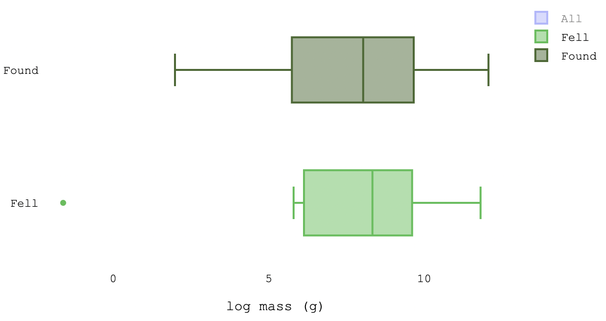
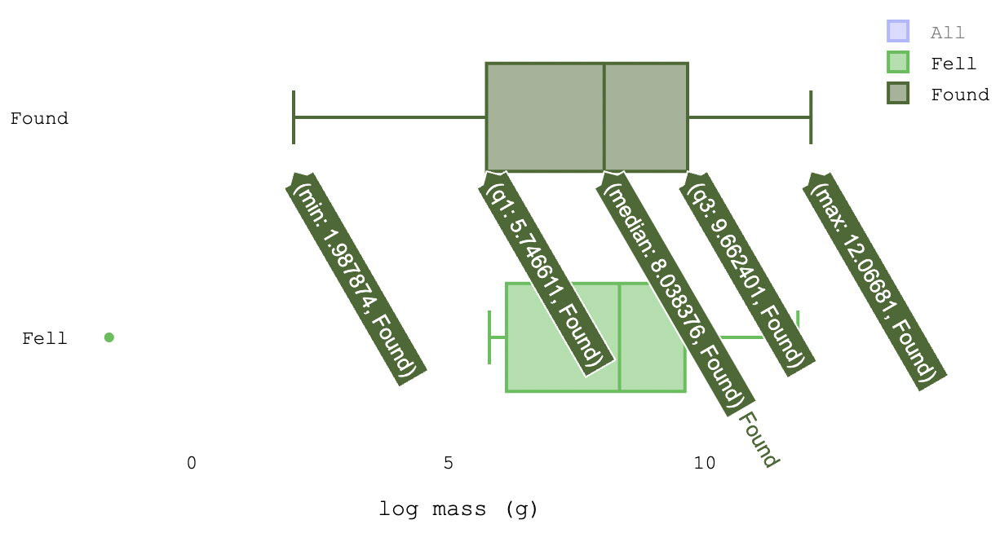

# Meteorite Mass

## Questions Addressed
1. What is the distribution of meteorite mass
   1. is it skewed in any particular way?
   2. what are the descriptive statistics such as the mean, median, mode, quartile ranges etc.?
   3. are there any outliers?
2. How does the distribution of observed landings **compare to** the distribution of meteorites that were discovered after landing over the years?
3. How is the distribution of meteorite mass related (if at all) to 
   1. geographical distribution of meteorite landings
   3. meteorite category
   3. year of meteorite landing/ discovery

## Visualisations: Histogram and Box and Whisker Plot
Mass is a continuous measure, so a histogram is ideal to answer questions related to its distribution. The box and whisker
plot allows users to observe outliers and any data at a glance, with labels illuminating the descriptive statistics referenced
in question 1ii. Different colours corresponding to different modes of discovery address question 2 and the data filters in the
control box allow the user to explore the relationship to other properties of meteorite landings (question 3).

**Histogram:**

**Box and whisker plot**

**Box and whisker plot with labels:**

**colour palette**

## Explanation

The same colour palette is used in these graphs as explained in the design rationale for the [line graph](year_graph.md)
as these graphs deal similarly with meteorite discovery categorisation and consistency is crucial to effective visualisations
(Unwin et al., 2008, p. 59). 

Users are given the option to switch between a box plot and histogram in order to familiarise them with both graphs and get a
sense of the differences between both in the context of the same data. Meteorite mass is heavily skewed towards very small values,
so a log scale is set as the default for the x-axis. The user is given the option to view both plots with either a log or linear scale
in order for them to gain an understanding of the difference and why a log scale is more appropriate in this case - it makes the user
more engaged in the process of *constructing* the visualisations.

## Evaluation

The simplicity of the design and the moderate use of colour allows for visually appealing visualisations,
very important as histograms and box & whisker plots tend to be one of the topics students find most daunting.
The semi-transparent design of the different histograms allows for convenient comparison between the different
modes of discovery with the goal of addressing question 2.

The interactive component of the visualisation could have been improved by allowing the user to manipulate bin
size, as interpreting histograms with different bin sizes, including equal and unequal intervals, is specifically
referenced in the GCSE syllabus. This could have allowed more advanced students to engage more deeply with the content.
t is important to note, however, that imposing constraints on users is an important consideration in designing
interactive graphics (Cairo, 2012, ch. 9), and there is already a significant amount of interactivity already
available. Including this function would certainly benefit a small number of students, but it deals with a relatively
advanced section of the syllabus and may confuse the majority, likely requiring more explanation and guidance than can
be provided through this application.

Finally, it may have been useful to display the histogram and box plot simultaneously on the same tab as each presents
a very different approach to visualising the distribution of a continuous variable and complement each other.
