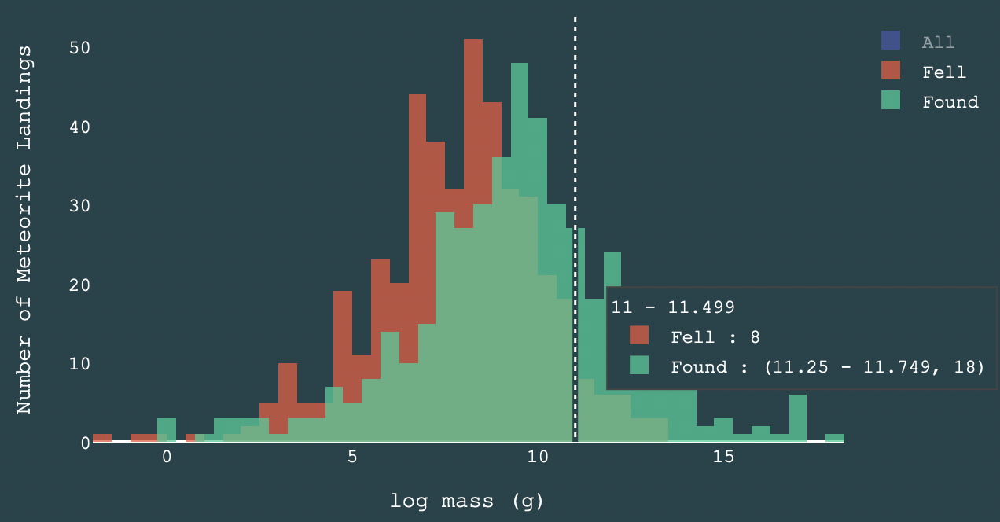

# Meteorite Mass

## Questions Addressed

How can the distribution of meteorite mass be described  (is it skewed in any particular way, what are the descriptive statistics
such as the mean, median, mode, quartile ranges etc.) and is there any particular relationship between this distribution and:
   1. geography of landings
   2. year of landing/ discovery
   3. whether the meteorite was seen falling or discovered after landing

## Visualisation: Histogram

## Visualisation: Box and Whisker Plot

