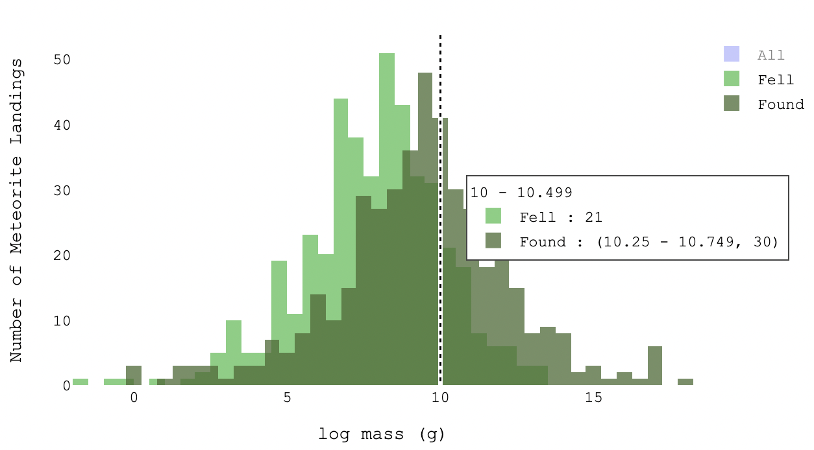

# Meteorite Mass

## Questions Addressed]
1. What is the distribution of meteorite mass
   1. is it skewed in any particular way?
   2. what are the descriptive statistics such as the mean, median, mode, quartile ranges etc.?
   3. are there any outliers?
2. How is the distribution of meteorite mass related (if at all) to 
   1. geographical distribution of meteorite landings
   3. meteorite category
   3. year of meteorite landing/ discovery

## Visualisations: Histogram and Box and Whisker Plot
allows to answer distribution q - outliers etc

**Histogram:**

**Box and whisker plot**

**Box and whisker plot with labels:**

**colour palette**

## Explanation

The same colour palette is used in these graphs as explained in the design rationale for the [line graph](year_graph.md)
as these graphs deal similarly with meteorite discovery categorisation and consistency is crucial to effective visualisations
(Unwin et al., 2008, p. 59).

## Evaluation