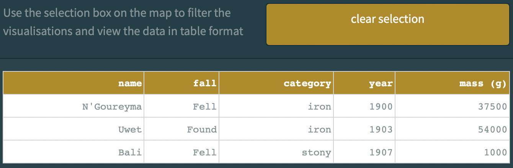

# Location of Meteorite Landings

## Questions Addressed

## Visualisation: Scatter Plot Map

**default map settings**

**markers colour-coordinated to meteorite category:**

**markers size-coordinated to meteorite mass:**

**geographical selection functionality**

### Explanation

### Evaluation