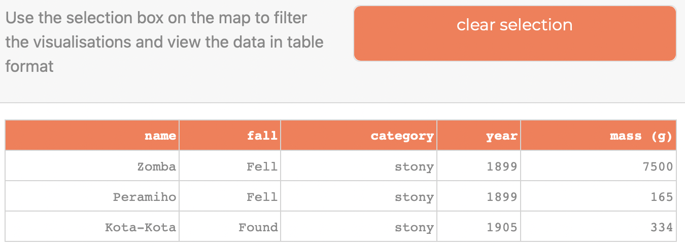

# Location of Meteorite Landings

## Questions Addressed
1. Are there any spatial patterns in the locations of the meteorite landings?
2. What is the geographical distribution of meteorite landings?
3. How is the geographic distribution of meteorite landings related to
   1. meteorite category?
   2. the year the meteorite was observed falling or found?
   3. meteorite mass?

## Visualisation: Scatter Plot Map
The latitude and longitude data for each meteorite landing was used to create a scatter plot map with
each data point corresponding to a single meteorite landing. Questions 1 and 2 can be addressed by observing
distribution of points.

The control box at the top of the dashboard (displayed in [visualisation_design.md](images/visualisation_design.md))
contains the tools intended to answer question 3; range sliders allow user to filter the plotted porints by year of
meteorite discovery and mass. It also includes interactive radio selection buttons which the user can use to add
complexity to the scatter plot map by coordinating map markers to meteorite category and/ or mass. The effects of
these controls can be seen in the following screenshots.

**default map settings:**

**map markers colour-coordinated to meteorite category:**

**map markers size-coordinated to meteorite mass (bubble map):**

**geographical selection & filtering functionality:**

**table (updates depending on the map markers selected by the user):**

### Explanation

Although scatter map plots are not on the GCSE syllabus which concerns the target audience, it has been noted that when maps
are used in data visualisation, "visual navigation is easier, even novice users can find correlations, patterns, and outliers"
(Grover, 2021). Given the most defining characteristic of the target audience is their lack of familiarity with basic visualisations, 
this intuitive nature of maps is valuable. The familiar medium of a map contextualises the other charts and graphs in a sense of 
reality, providing the user with a reminder that bar charts and histograms reflect real-world data too. For this reason, the scatter
plot map was chosen as the central visualisation, constantly visible as a point of reference on the left side of the screen while the
user navigates through the tabs on the right side. The decision to include the table followed a similar logic; giving users the option
to select data points from the map and view it in a familiar format makes the link between the visualisations and the numbers explicit.

In keeping with the functional approach adopted, a minimalistic design was chosen for the map with a light background that does not
distract from the plotted data points. Following Cairo's guidance (Cairo, 2016, ch.10), the markers are semi-transparent to improve
clarity adn reduce visual clutter. Marker sizes are kept proportional to mass (another significant point of emphasis for Cairo)
by setting size to double the logarithm of meteorite mass for each data point. 

### Evaluation